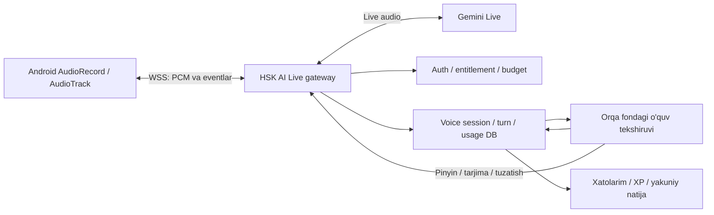

**HSK AI — Android Live Voice implementatsiya rejasi**

Sana: 2026-10-02, Asia/Shanghai. Tekshirilgan kod: `a348fb16`.
Holat: birinchi implementatsiya yozildi, feature flag o'chiq. Android `direct`
va `play` flavor Kotlin compile o'tdi, `Pixel_8` emulyatorida ilova ochildi.
Python testlarini ishga tushirish uchun muhitda FastAPI/SQLAlchemy yo'q.
Haqiqiy Gemini Live akkaunt testi, usage semantikasi/xarajat tekshiruvi,
fizik qurilmada audio testi, migration deploy va pilot hali bajarilmagan.

Hozirgi scope: migration `0095_android_live_voice`, authenticated Android WSS
relay, `turn/live` sessiya ajratilishi, sessiya ulanish lease/resumption,
usage log, 180 soniya/7 dialog/`$0.15` sessiya chegarasi va Android PCM audio
ekrani. `ANDROID_VOICE_LIVE_ENABLED` default `false`; paid Gemini billing,
musbat cap va aniq user allowlist ham talab qilinadi. Rejaning worker bilan
kechiktirilgan enrichment, billing rezerv/reconciliation, qayta yuklangandan
keyin UI sessiyasini tiklash, fon lifecycle va to'liq telemetriya bosqichlari
hali bajarilmagan.

Maqsad: foydalanuvchi suhbatni bir marta boshlaydi, odatdagidek xitoycha gapiradi va AI ovozda javob beradi. AI gapirayotganda foydalanuvchi gap boshlasa, javob to'xtaydi va AI yangi gapni tinglaydi. Kurs darajasi, dars so'zlari, pinyin, tarjima, xatolar va yakuniy o'quv natijasi shu suhbat bilan bog'lanadi.

**1. Tanlangan yechim va uning chegarasi**

Asosiy yo'l: native Android audio engine → mavjud HSK AI backend orqali WSS relay → Gemini Live. Tavsiya etilgan model `gemini-3.8-live`: rasmiy sahifada oddiy jonli ovozli suhbatlar uchun standart model sifatida ko'rsatilgan. Ushbu loyiha akkauntida mavjudligi, haqiqiy tezligi va xitoycha nutq sifati 0-bosqichda tekshiriladi. [Google model hujjati](https://ai.google.dev/gemini-api/docs/models/gemini-3.8-live).

Backend foydalanuvchini tekshiradi, kurs kontekstini beradi, provayder bilan ulanishni boshqaradi va xarajatni hisoblaydi. Android faqat o'z backendimizga ulanadi. Bu tanlov mavjud native auth va `OriginGuardInterceptor` bilan mos keladi, limitni serverdan to'xtatishga imkon beradi. Relay qo'shadigan kechikish prototipda alohida o'lchanadi. Google shu server orqali ulanish usulini qo'llab-quvvatlaydi. [Live API overview](https://ai.google.dev/gemini-api/docs/live-api).

V1 Android'dagi mavjud AI Voice joyida ishlaydi. Amaldagi navbat bilan audio yuborish oqimi texnik zaxira sifatida ishlatiladi. Zaxiraga o'tish ekranda tushuntiriladi va foydalanuvchining tugatilgan dialoglari bitta sessiya tarixida saqlanadi.

Hozirgi gate mavjud `GEMINI_API_KEY` va `GEMINI_BILLING_TIER=paid` qiymatlarini ishlatadi, alohida Live billing profili yo'q. Shu sababli flag real provider usage va xarajat akkauntda tekshirilmaguncha o'chirilgan qoladi. Pilotdan oldin Live audio usage metadata'sining turnmi yoki yig'ilgan counter ekanini aniqlash va `$0.15` cap'ni invoice bilan solishtirish kerak; unknown usage uchun konservativ taxmin bor, u provider invoice'iga teng kafolat emas.

OpenAI Realtime ham nutqdan nutqqa suhbat, foydalanuvchining AI gapini bo'lishi va WebRTC/WebSocket ulanishini qo'llab-quvvatlaydi. Hozirgi Gemini SDK/provayder infratuzilmasi sabab reja bitta Live integratsiyasiga tayangan. Gemini prototipi sifat yoki mavjudlik mezonidan o'tmasa, provider qarori qayta ko'rib chiqiladi. [Official OpenAI documentation](https://developers.openai.com/api/docs/guides/realtime).

**2. Hozirgi kodda aniqlangan holat va UI auditi**

| Kuzatilgan holat | O'quvchiga ta'siri | Taklif etilgan o'zgarish | Fayl |
|---|---|---|---|
| `MediaRecorder` butun `.m4a` faylni yozadi va Base64 qilib yuboradi | Gapni aytish va yuborish uchun mikrofonni qayta bosish kerak | AudioRecord bilan kichik PCM bo'laklarini uzluksiz yuborish | `core/audio/VoiceRecorder.kt`, yangi `LiveVoiceAudioEngine.kt` |
| Backend avval STT, keyin alohida matnli AI so'rovini bajaradi | Har gapdan keyin bir necha bosqichli kutish paydo bo'ladi | Native speech-to-speech oqimi; transkript va o'quv tekshiruvi orqa fonda | `app/services/voice_practice_service.py`, yangi Live provider/service |
| `canAnswer` va recording guard `isSending` paytida mikrofonni cheklaydi | Javob vaqtida foydalanuvchi tabiiy aralasha olmaydi | Live rejimda audio kirishi va chiqishi alohida boshqariladi | `feature/voice/VoiceViewModel.kt` |
| `speak()` ochilish salomlashuvida chaqiriladi; `applyTurn()` oddiy javob uchun uni chaqirmaydi | Har bir AI javobining ovozga aylanishi hozirgi kodda kafolatlanmagan | Har bir Live javob audio player oqimida kuzatiladi; zaxira rejimida TTS chaqiruvi alohida tuzatiladi | `VoiceViewModel.kt` |
| Ekran qolgan barcha holatlarda "gapiryapti" deydi; panda doim Talk mood'da | Kutish, jimlik va haqiqiy ovoz farqlanmaydi | Animatsiya va holat AudioRecord/AudioTrack daliliga bog'lanadi | `feature/voice/VoiceCallScreen.kt` |
| Tarix, xato va baho bitta tayyor JSON javobdan olinadi | Jonli audio kelayotganda bu kontraktni aynan takrorlash ovozni kechiktiradi | Audio/transkript oqimi va tekshirilgan o'quv metadata uchun alohida eventlar | API/DTO, yangi enrichment service |

UI uchun aniq taklif: birlamchi "Suhbatni boshlash" tugmasi; suhbat ichida mikrofonni o'chirish/yoqish, suhbatni tugatish, matn yozish va "Nima deyish?". Mikrofon jonli rejimda yozib-yuborish tugmasi bo'lmaydi. Yuqorida server bergan vaqt va 7 dialog progressi ko'rsatiladi. Xitoycha javob hanzi bilan paydo bo'ladi, tekshirilgan pinyin va tarjima tayyor bo'lganda qo'shiladi. Pastdagi boshqaruv klaviatura va Android navigation inset'lariga mos bo'ladi.

UI xavfi o'rta: boshqaruv va lifecycle o'zgaradi. Backend/audio xavfi yuqori: uzluksiz ulanish, xarajat va parallel eventlar boshqariladi. Native `direct` va `play` variantlari bir xil Live funksiyani oladi, paywall har bir variantning mavjud siyosati orqali ochiladi.

**3. Arxitektura va audio yo'li**

Audio input: mono, PCM16 little-endian, 16 kHz. Audio output: mono PCM16, 24 kHz. Provayder WSS bilan ishlaydi. Qurilma 16 kHz capture'ni bermasa, uning haqiqiy sample rate'idan resampling qilinadi. [Live texnik spetsifikatsiya](https://ai.google.dev/gemini-api/docs/live-api).

Android capture bo'laklari boshlang'ich 20–40 ms; playback uchun kichik, chegaralangan buffer qo'llanadi. Bitta katta yozuvni yig'ish amalga oshirilmaydi. `AudioTrack.MODE_STREAM` uchun boshlang'ich buffer Android minimumidan hisoblanadi va qurilmada underrun/kechikish bo'yicha sozlanadi. "Har telefonda 100 ms buffer" kabi universal qiymat qabul qilinmaydi.

Tarmoq yuborish navbati va playback navbati bounded bo'ladi. Audio eskirib yig'ilsa, ulanishni qayta tiklash holati ochiladi; eski audio keyinchalik qayta yuborilib yangi gap sifatida ishlatilmaydi. Audio paketlarida `connection_epoch`, `generation_id`, `sequence` mavjud bo'ladi. Yangi ulanish eski paketlarni rad etadi.

AI gapini bo'lish kelganda server generation'ni bekor qiladi, Android playback buffer'ini tozalaydi va eski generation paketlarini tashlaydi. Tugallangan va bo'lingan javoblar alohida belgilanadi. Provayder yuborgan matn foydalanuvchi aynan shu matnni to'liq eshitganini isbotlamaydi; mos kelmaydigan matn uchun "javob bo'lindi" holati ko'rsatiladi. [Streaming bo'yicha tavsiyalar](https://ai.google.dev/gemini-api/docs/live-api/best-practices).

Android audio: `VOICE_COMMUNICATION`, audio focus, to'g'ri communication output route va mavjud AEC ishlatiladi. `AcousticEchoCanceler` barcha qurilmalarda bor deb olinmaydi; `isAvailable()` va yaratilgan effekt tekshiriladi. AI ovozi qayta mikrofon orqali ketib yangi dialogga aylanishi chiqarishga to'siq bo'ladi. [Android AEC](https://developer.android.com/reference/android/media/audiofx/AcousticEchoCanceler).

V1 suhbat ilova ekranda turganda ishlaydi. Ilova fon holatiga o'tganda capture/playback to'xtaydi va provider ulanishi yopiladi; qaytishda saqlangan sessiya holati ko'rsatiladi. Target SDK 36 bo'lgani uchun audio focus va microphone lifecycle haqiqiy qurilmada tekshiriladi. Android 15+ audio focus uchun top app yoki foreground service talab qiladi. [Android audio focus](https://developer.android.com/media/optimize/audio-focus).

**4. Backend kontrakti va sessiya holati**

Yangi endpointlar, eski Android voice API bilan birga:

| Kontrakt | Vazifa |
|---|---|
| `POST /api/v3/android/voice/live/session/start` | Auth, entitlement, byudjet, parallel sessiya nazorati; idempotent `request_id` bilan sessiya yaratish |
| `WSS /api/v3/android/voice/live/sessions/{session_id}/stream` | Shu egaga tegishli sessiyaga Bearer header bilan ulanish; audio va control eventlar |
| `POST /api/v3/android/voice/live/sessions/{session_id}/end` | Provider/audio yopish, xarajatni hisobga olish, idempotent finalization boshlash |
| `GET /api/v3/android/voice/live/sessions/{session_id}` | Server holati, oxirgi tugallangan dialoglar va `pending/partial/complete` natija |

Start javobi: `protocol_version`, `session_id`, shu origin ichidagi stream path, audio formatlar, `max_dialogs`, `expires_at`, limit holati va kurs uchun ko'rsatiladigan so'zlar. Model/kurs haqidagi ichki murabbiylik rejasi frontendga chiqarilmaydi.

Android WSS header qo'llab-quvvatlagani uchun auth token URL query'ga kiritilmaydi. Auth tekshiruvi amaldagi native auth service'iga tayanadi; boshqa userning `session_id` si, token muddati va bloklangan status tekshiriladi. 401 bo'lsa mavjud auth refresh oqimi bir marta ishlaydi. Providerning haqiqiy API kaliti faqat serverda bo'ladi.

Control eventlar JSON, audio paketlari bizning WSS leg'da binary bo'ladi. Binary paket header formati v1 kontraktida yoziladi; generation'ni JSON xabari kelgan vaqtga qarab taxmin qilish mumkin emas.

| Event guruhi | Misollar va server majburiyati |
|---|---|
| Sessiya | `session.ready`, `session.reconnecting`, `session.ending`, `session.ended`, `error` |
| User nutqi | `speech.started`, `user.transcript.delta`, `user.transcript.final`; bitta server turn ID |
| AI javobi | `response.started`, `ai.transcript.delta`, `ai.transcript.final`, audio, `response.interrupted`, `response.completed` |
| O'quv ma'lumoti | `turn.enriched`: aynan shu turn/version uchun pinyin, tarjima, tekshiruv, 2 taklif |
| Limit | `limit.updated`, `budget.warning`, `budget.exhausted` |
| Client boshqaruvi | `microphone.mute`, `microphone.unmute`, `text.submit`, `playback.progress`, `session.end`, heartbeat |

Eventlar `event_id`, server `sequence`, `turn_id`, zarur joyda `generation_id` bilan keladi. Client yuborgan transkript, narx, limit yoki XP server haqiqatini belgilamaydi. `playback.progress` UX va tashxis uchun ishlatiladi.

WebSocket davomida bitta uzoq DB transaction ushlab turilmaydi. Provider send/receive, heartbeat/watchdog va enrichment mustaqil async vazifalar bo'ladi; DB yozuvlari qisqa transaction'larda bajariladi. Sessiyaga bitta owner lease va connection epoch beriladi; ikki provider ulanishini parallel ochishga ruxsat berilmaydi.

Reconnection boshlang'ich chegarasi 10 soniya, ko'pi bilan 2 urinish. Provider session resumption handle serverda qisqa muddat turadi. `GoAway` yoki oddiy uzilish yangi ulanish va qolgan vaqt/byudjet bilan boshqariladi. Server qayta ishga tushsa, persistent tarixdan qayta ochish yoki natijani xavfsiz yopish bajariladi; ishlayotgan socket boshqa processga ko'chdi deb taxmin qilinmaydi. [Session management](https://ai.google.dev/gemini-api/docs/live-api/session-management).

Gateway replica/worker konfiguratsiyasi 0-bosqichda qayd etiladi. Process ichidagi registry socketlarni boshqaradi; owner lease va yakunlash DB orqali himoyalanadi. Boshqa processdagi reconnect mavjud owner yopilgan yoki lease tugaganidan so'ng ishlaydi. Heartbeat yo'qolganda provider audio davom ettirilmaydi.

Fallback oldidan Live provider yopiladi va pending generation yakunlanadi/bekor qilinadi. Mode transition server orqali xuddi shu asosiy sessiyada, qolgan dialog/limit bilan bajariladi. Bir vaqtda Live hamda REST audio so'rovlarini qabul qilish bloklanadi. Faqat faol transport uchun xabar endpointi ishlaydi.

**5. Kursga bog'langan suhbat va tekshirish**

Sessiya boshida mavjud `VoicePracticeService` bilan bir xil HSK darajasi, joriy dars, target/review words, suhbatdosh, scenario va learner plan snapshot olinadi. AI prompt qisqa Mandarin gaplar, foydalanuvchi darajasi, muhim xatoga muloyim tuzatish va tanlangan tezlikni belgilaydi. "Sekin gapirish" provider nutq ko'rsatmasi bilan ishlaydi; playback sample rate'ini o'zgartirib pinyin/ovozni buzmaymiz.

Gemini Live modelida structured output yo'q; javob audio modality va output transcript orqali olinadi. Modelga qo'yiladigan 3.8 konfiguratsiya SDK'dagi eski preview misollari bilan ko'r-ko'rona ko'chirilmaydi: `thinking_level` va eski affective-dialog fieldlari yuborilmaydi, doim yoqilgan proactive audio'ni o'chirishga urinish qilinmaydi. [Model cheklovlari va konfiguratsiya](https://ai.google.dev/gemini-api/docs/models/gemini-3.8-live).

O'quv metadata orqa fonda mavjud `AIService` va qisqa structured so'rov bilan tayyorlanadi. Input — yakunlangan user transkript, AI'ning haqiqiy output transkripti va muzlatilgan dars konteksti. Output — AI gapining pinyini/tarjimasi, muhim xato uchun correction va `error_type`, keyingi gapga mos 2 taklif. AI aytgan gap metadata service'da qayta yozilmaydi.

Har sessiya uchun enrichment ketma-ket, bounded bajariladi; kichik kontekst va cheklangan token/timeout ishlatiladi. Har delta/chunk uchun yangi matnli AI chaqiruvi qilinmaydi. Ishlar DB'da `pending/running/done/failed` bilan turadi, qayta ishga tushganda tiklanadi va har turn bir marta hisoblanadi. Enrichment xatosi audio suhbatni to'xtatmaydi.

`pending/failed` tekshiruv "to'g'ri gapirdi"ga aylantirilmaydi. Natijada tekshirilgan yaxshi gaplar, aniqlangan xatolar va tekshirilmagan gaplar alohida ko'rsatiladi. Hozirgi `correction == null` bo'lsa yaxshi deb olish qoidasi Live natijasida evaluation status bilan aniqlashtiriladi. Yakunlash worker'i kutilayotgan tekshiruvlarni chegaralangan muddat kutadi, keyin partial natija qaytaradi.

Partial natijadan keyin tayyor bo'lgan tekshiruv shu turn ID bo'yicha natija revision'ini yangilaydi. Har turn uchun mistake projection yozilgan holat saqlanadi; worker qayta ishlasa xato ikkinchi marta yozilmaydi. XP faqat sessiya finalization'ida bir marta beriladi. Kech kelgan enrichment XP yoki kvotani qayta sarflamaydi; klient yangilangan natijani event yoki GET bilan oladi.

Transkriptning o'zi ton/talaffuzni ishonchli o'lchamaydi. Grammar/word tuzatishlari mavjud xato turlari bilan mos yoziladi; "pronunciation" uchun qo'shimcha dalil bo'lmasa ton balli yoki aniq talaffuz tashxisi chiqarilmaydi. Raw audio doimiy saqlanmaydi; prototip uchun zarur diagnostika namunasi alohida rozilik va qisqa retention bilan olinadi.

"Nima deyish?" dars/review so'zlari va oxirgi tayyor takliflardan quriladi. Ibora yoki matn yuborish tugallanmagan mic input'ni aniq bekor qilib, bitta typed turn yaratadi. Ovoz va matn bitta turn uchun ikki marta hisoblanmaydi. Til kodlari backenddagi mavjud normalizatsiya bilan moslanadi; Android `values-uz`, `values-ru`, `values-tg` to'liq to'ldiriladi.

**6. Limit, xarajat va DB o'zgarishi**

Amaldagi `SPEAKING_SESSION` entitlement engine kirish qarorini beradi. Bepul kvota hardcode qilinmaydi. Hozirgi maksimal 7 dialog saqlanadi. Live uchun boshlang'ich taklif: 180 soniya yoki 7 hisoblanadigan dialogdan qaysi biri oldin tugasa, sessiya tugaydi. Qo'shimcha vaqt chegarasi yangi operational cheklov sifatida ekranda oldindan ko'rsatiladi; bu qiymat prototip/pilotdan keyin yakunlanadi.

Bepul slot birinchi haqiqiy user gapiga AI javobi kelganida bir marta sarflanadi. Intro, jimlik, permission denial va provider ishga tushmasligi slot/XP bermaydi. Tugallanmagan input count bo'lmaydi. Mazmunli AI javobi chiqqandan keyingi barge-in alohida yangi bepul sessiyaga aylanmaydi. Dialog hisoblash chegarasi provider event fixture'lari bilan yozilib, bir marta transaction'da saqlanadi.

Sessiyaga kirishda foydalanuvchi/byudjet qatori bloklanadi, qolgan segment/trial byudjetdan Live uchun rezerv ajratiladi. Rezerv qolgan AI so'rovlarini ham hisoblashda ko'rinadi. Tugaganda unused rezerv qaytariladi; haqiqiy ishlatilgan xarajat yoziladi. Free foydalanuvchi uchun sessiya xarajati operatsion free-pool limitidan boshqariladi. Byudjetsiz eski paid akkaunt uchun Live'da cheksiz xarajatga yo'l berilmaydi: aniq operational cap bilan zaxira voice kirishi saqlanadi.

Boshlang'ich operational takliflar: bitta userga bitta faol voice sessiya, start urinishlariga throttle, 30–45 soniya mazmunli faollik bo'lmasa yopish, sessiya va kunlik global Live spend cap. Sessiya spend rezervi uchun boshlang'ich pilot qiymat `$0.10`; real token receipt'lari, kech keladigan usage va provider cancellation xarajati o'lchanib, xavfsizlik zaxirasi aniqlanadi. Bu son aniq invoice maksimumi deb va'da qilinmaydi.

Hozirgi pricing service faqat umumiy prompt/completion tokenlarini hisoblaydi; noma'lum model `unpriced` va nol xarajatga tushadi. Live uchun audio/text input/output alohida tarif bilan hisoblanadi. Har usage hodisasida tarif va billing tier snapshot yoziladi. Unknown tarif bo'lsa yangi Live inference ochilmaydi. Usage receipt yo'qolsa konservativ hisob va tashxis belgisi saqlanadi; "nol xarajat" deb yozilmaydi.

Provider usage bir javobga tegishlimi yoki yig'ilgan counter'mi — 0-bosqich dalili bilan adapter kontraktiga yoziladi. Kontekstning navbatlarda qonuniy qayta hisoblangan tokenlari xato deb dedupe qilinmaydi; faqat aynan bir receipt qayta kelishi dedupe qilinadi. Provisional xarajat haqiqiy receipt kelganda shu hisob davri bo'yicha reconcile qilinadi, ikkala summa ustma-ust qo'shilmaydi. Reconnect yangi provider connection ID oladi, ichki voice session va uning rezervi saqlanadi.

2026-10-02 da ochilgan rasmiy narx: audio input `$3/1M` token yoki taxminan `$0.005/min`, audio output `$12/1M` yoki `$0.018/min`; text input/output `$0.75/$4.50` per 1M token. [Google pricing](https://ai.google.dev/gemini-api/docs/pricing).

Faqat yangi audio uchun oddiy misol: 3 minut input + 1 minut output ≈ `$0.033`. Live'da oldingi audio kontekst navbatlar davomida qayta hisoblanadi, transkript uchun ham text token xarajati bor va 3.8 proactive listening xarajati saqlanadi. Shu sabab `$0.033` sessiyaning umumiy narxi yoki maksimumi emas. To'liq tannarx real modality usage, enrichment va relay xarajatidan olinadi. Context compression sozlamalari prototipda sifat va tannarx bilan birga tanlanadi. [Live billing qoidalari](https://ai.google.dev/gemini-api/docs/live-api/best-practices).

Taklif etilgan minimal persistence:

| DB o'zgarishi | Saqlanadigan muhim holat |
|---|---|
| `voice_practice_sessions` uchun additive `voice_mode` | `turn/live`; eski qator default `turn`; mode transition nazorati |
| Yangi `voice_live_sessions` | Asosiy voice ID, provider/model, status, owner lease/epoch, server deadline, budget ID, rezerv va usage holati |
| Yangi `voice_live_turns` | Unique turn ID, yakuniy user/AI matni, interruption, evaluation status, metadata va enrichment retry/lease |
| `ai_usage_events` uchun additive maydonlar | Unique dedupe key, modality usage tafsilotlari va price snapshot; eski qatorlar nullable/default bilan |

Tarix JSON'i mavjud yakuniy natija uchun projection bo'lib qoladi. Live turnlar canonical yozuvlar bo'ladi; bir nechta async worker bir JSON history'ni parallel o'zgartirmaydi. Eski `_reusable_session` Live qatorni olib reset qilmasligi uchun mode filtri kerak. Eski message API faol Live sessiyani qabul qilmaydi. Migration navbat raqami implementatsiya paytida oxirgi repository migration'dan keyin olinadi.

XP/streak va `CourseMistakeService` yozuvi server finalization'da, activity reference bo'yicha bir marta amalga oshadi. Reconnect, repeated end va app process death ikkinchi XP yoki ikkinchi kvota yozmaydi. Userning lokal kun chegarasi mavjud daily-window service orqali olinadi. Session yopish va transport downgrade poygasi transaction/lease bilan himoyalanadi.

**7. Android boshqaruvi va uzilishlar**

Holat bitta "gapiryapti/tinglayapti" enumga sig'dirilmaydi. `ConnectionState` (`connecting/connected/reconnecting/ending/ended/failed`), `InputState` (`muted/listening/speechActive`) va `OutputState` (`idle/buffering/playing`) alohida saqlanadi. Capture va playback bir vaqtda faol bo'lishi mumkin. UI shu haqiqiy holatlardan kelib chiqadi.

Mic permission provayderga pullik ulanish ochilishidan oldin olinadi. Mic o'chsa capture to'xtaydi va serverga signal beriladi; uzoq mute'da provider ulanishi ham yopiladi, chunki 3.8 listening xarajati davom etishi mumkin. Focus yo'qolishi, kiruvchi telefon qo'ng'irog'i yoki headset uzilishi capture/playback'ni to'xtatadi. Qayta ulanish foydalanuvchiga ko'rinadi.

Back, Close va ekran chiqishi bitta idempotent end oqimini bajaradi. Qurilma aylanganda ViewModel'dagi sessiya saqlanadi; yangi capture/provider ochilmaydi. `onCleared` va lifecycle cleanup AudioRecord, AudioTrack, AEC, audio focus va socket vazifalarini bo'shatadi. Backend heartbeat/deadline foydalanuvchi force-stop qilgan holatni ham yopadi.

Bluetooth permission/route ishlari haqiqiy qo'llab-quvvatlanadigan Android API darajasiga qarab qilinadi; Android 8–11 va 12+ uchun mos yo'l tanlanadi. AEC yoki route sifati Live uchun yetarli bo'lmasa, typed/navbat bilan audio rejimi ochiq tushuntirish bilan beriladi. Bu telefonlardagi sifat cheklovi pilot hisobotida qayd etiladi.

**8. Amalga oshirish bosqichlari va qabul mezonlari**

Bosqichlar ketma-ket bajariladi. Har bosqich natijasi keyingisi uchun shart; prototipda ishlamagan sifatni feature flag bilan ommaga chiqarish mumkin emas.

| Bosqich | Bajariladigan ish | Qabul qilinadigan dalil |
|---|---|---|
| 0. Provider prototipi | Shu akkaunt/region/billing'da 3.8 Live, SDK 1.75.0 mosligi, input/output transcript, interruption, usage semantikasi, SDK upgrade zarurati va relay region'ini tekshirish. 30 xitoycha gap, HSK1–4, uz/ru/tg izohlar, 20 gapni bo'lish holati | Haqiqiy sample audio, latency jadvali, modality usage dump (maxfiy kalit va tokenlarsiz), noto'g'ri config'lar ro'yxati, pricing profil. Model haqiqatan ishlaydi |
| 1. Sessiya va billing | Additive migration, auth, start/end idempotency, mode isolation, lease, quota admission, spend rezerv va modality hisob | Ikki start/ikki end, boshqa user, 0 turn, billing unknown, trial/cooldown va parallel AI holatlarida DB to'g'ri |
| 2. Live gateway | Provider adapter, WSS protocol, audio/control relay, cancellation, backpressure, heartbeat, reconnect, usage dedupe | Event fixture'lari va test client bilan 7 dialog; interrupt eski audioni qaytarmaydi; barcha close yo'llari provider vazifalarini yopadi |
| 3. Android audio | AudioRecord/AudioTrack/AEC, socket, permission/focus, composite holat, lifecycle va audio route | Jismoniy telefonlarda har AI javobi eshitiladi, app o'z ovozini user deb olmaydi, mic mute/background capture'ni yopadi |
| 4. O'quv integratsiyasi va UI | Lesson snapshot, prompt, async enrichment, hanzi/pinyin/tarjima, hints, yakuniy natija, mistakes va XP | AI darajaga mos gapiradi, metadata aynan eshitilgan javob transcript'iga bog'langan, tekshirilmagan gapga yaxshi baho berilmaydi |
| 5. Qayta tiklash va regression | Wi-Fi/LTE almashish, server restart, token expiry, process death, transport downgrade, Play/direct, shared backend smoke | Quota/reward/cost ikki marta yozilmaydi; ikkala APK build o'tadi; kurs/quiz/homework/API oqimlari o'tadi |
| 6. Pilot va chiqarish | Allowlist, 20–30 tester, kamida 100 sessiya/500 dialog; xarajat, nosozlik va ovoz sifati kuzatuvi | Quyidagi chiqarish mezonlari bajariladi; admin uchun release feedback draft tayyor |

V1 uchun rejalashtirilgan sifat mezonlari, prototip/pilot natijasi sifatida o'lchanadi:

| O'lchov | Boshlang'ich qabul chegarasi |
|---|---|
| Gap tugashi → birinchi eshitilgan AI audio | Barqaror Wi-Fi/LTE'da median ≤1.8 s, p95 ≤3.5 s; VAD kutishi shu vaqt ichida |
| Server `interrupted` hodisasi → player jimligi | ≤150 ms; user gapidan to'xtashgacha umumiy vaqt ham alohida o'lchanadi |
| Barge-in umumiy vaqti | Oddiy tarmoqda median ≤300 ms, p95 ≤600 ms |
| Start → birinchi audio | p95 ≤5 s |
| Texnik sessiya start muvaffaqiyati | ≥98%, permission denial va haqiqiy access denial alohida hisoblanadi |
| Echo, playback tugagach eski audio kelishi | Nazorat ssenariylarida 0; takrorlanuvchi echo chiqishga to'siq |
| Quota/XP/end/usage duplicate | 0 |
| Enrichment | ≥95% turn uchun tayyor; qolganlari tekshirilmagan sifatida ko'rsatiladi |
| Level/pinyin/tarjima | Ko'rib chiqilgan namunalar ≥95% to'g'ri; xavfli tizimli xato chiqishga to'siq |
| Xarajat | Haqiqiy to'liq sessiya tannarxi rezerv/profit chegarasiga sig'adi; p95 va missing-usage ulushi alohida tekshiriladi |

VAD boshlang'ich silence qiymati taxminan 800 ms, HSK1'dagi sekin gaplar uchun prototipga qarab oshiriladi. 500–900 ms tabiiy pauzalar va birinchi bo'g'in kesilishi maxsus tekshiriladi. Bu sozlama tezlik bilan jumla to'liqligi o'rtasidagi tanlovdir. [VAD qo'llanmasi](https://ai.google.dev/gemini-api/docs/live-api/capabilities).

Jismoniy QA: kamida Samsung, Xiaomi/Redmi va Pixel; Android 8–11, 12–14 va 15/16 guruhlari; speaker, simli headset, Bluetooth; jim xona/shovqin, sekin gap, gapni bo'lish, incoming call, ruxsat rad etish, mute, screen lock, rotation va force-stop. Emulator UI/protocol/build uchun ishlatiladi; uning audio sifati telefon QA o'rnini bosmaydi.

Gateway capacity avval 5, keyin 10 va 25 concurrent sessiyada, akkauntning haqiqiy provider concurrency limitidan oshirmasdan o'lchanadi. Sessiya tugagach active task/socketlar bazaviy holatga qaytishi kerak. CPU, memory, DB pool, egress, audio queue va provider 429/503 kuzatiladi. Max concurrency shu natija asosida belgilanadi.

**9. Fayllar va test chegarasi**

Mavjud fayllarni minimal moslashtirish:

| Fayl/guruh | Ish |
|---|---|
| `app/config.py`, `.env.example` | Live flag, alohida provider/model/billing, vaqt/spend cap; faqat placeholderlar |
| `app/main.py` | Live router, worker/watchdog lifecycle, shutdown |
| `app/services/voice_practice_service.py` | Shared context, mode isolation, yakuniy projection va idempotent finalization uchun kichik helpers |
| `app/db/models/voice_practice_session.py`, `app/db/models/ai_usage.py`, models init, Alembic | Additive schema va unique/indexlar |
| `app/services/ai_usage_budget_service.py` | Live modality tarif, rezerv va live ledger bilan mos byudjet hisobi |
| `android/.../HskAiApplication.kt`, `MainActivity.kt` | Repository/audio engine injection, eligibility/mode, lifecycle |
| `android/.../feature/voice/VoiceViewModel.kt`, `VoiceScreen.kt`, `VoiceCallScreen.kt` | Composite holat, Live controls, transcript va final result |
| `android/.../data/api/AndroidFeatureDto.kt` | Evaluation status va natija uchun backward compatible metadata |
| Android resources, manifest | uz/ru/tg matnlar; route uchun zarur permission bo'lsa minimal qo'shish |

Yangi mas'uliyatlar mavjud faylga tabiiy sig'maganda ajratiladigan fayllar: `app/api/android_live_voice.py`, `app/services/live_voice_service.py`, `app/services/live_voice_provider.py`, `app/services/live_voice_enrichment_service.py`, `app/db/models/voice_live.py`; Android `core/audio/LiveVoiceAudioEngine.kt`, `core/network/LiveVoiceSocket.kt`, `data/api/AndroidLiveVoiceApi.kt`, `data/repository/LiveVoiceRepository.kt`. Yakuniy son implementatsiyada mavjud helperlar qayta ishlatilganidan so'ng olinadi.

Majburiy backend tekshiruvlar: auth/ownership, session/mode concurrency, empty quota, interruption accounting, idempotent end/reconnect, pricing modality va duplicate usage, budget rezerv/cooldown, enrichment failure, migrations va eski voice API. Mavjud `test_android_features_api`, `test_voice_practice_daily_limit`, `test_voice_practice_course_context`, `test_voice_practice_evaluation`, `test_voice_practice_error_type` va entitlement testlari tegishli o'zgarish bilan ishlatiladi.

Android tekshiruvlar: mavjud barcha tegishli static checks, ikkala flavor compile/unit/lint/assemble, Live state/socket/audio boshqaruvi uchun JVM tests va jismoniy qurilma smoke. Backend shared code tegsa, loyiha qoidasidagi Mini App Playwright smoke ham o'tkaziladi: ochilish/routing, quiz/homework submit, lesson navigation, progress va paywall. Eski bot/desktop/Telegram API kontraktlari regression sifatida tekshiriladi.

Test yozishdan oldin himoya qilinadigan invariant yoziladi; implementationni aynan takrorlovchi testlar ko'paytirilmaydi. Bu reja tayyorlash vaqtida test yoki API inference ishga tushirilmagan.

**10. Chiqarish, kuzatuv va qaytish yo'li**

Server flag default o'chiq bo'ladi. Backend va additive migration avval chiqadi. Live capability faqat yangi Android build va allowlist uchun yoqiladi; eski build eski kontraktni oladi. App capability flag'dan yangi protocol version borligini biladi.

Pilotdan keyin 10% → 25% → 50% → 100% bosqichlari o'tiladi. Har bosqichdan keyin yetarli sessiya yig'ilib, latency/failure/cost ko'rsatkichlari tekshiriladi. Kill switch yangi Live startlarni to'xtatadi; aktiv sessiyalar belgilangan grace bilan xavfsiz yopiladi va qolgan tarix/kvota saqlanadi. DB rollback uchun additive maydonlarni o'chirish talab qilinmaydi.

Operational eventlar: `live_voice_start`, `first_audio`, `turn_completed`, `interrupted`, `reconnect`, `fallback`, `enrichment_failed`, `session_end`, `budget_stop`. Metrikalar server/app monotonic timestamp'laridan hisoblanadi; turli qurilma soatlarini bevosita ayirish mumkin emas. Analytics'da raw audio, auth header va provider handle yozilmaydi.

Biznes metrikalar: suhbat start/completion, user gapirgan vaqt, haqiqiy dialoglar soni, target/review so'z ishlatish, 7 kun ichida qaytish, session tannarxi, trial/paid/free segment bo'yicha ishlatish, feedback bahosi. Akustik mezonlar mavjud bo'lmaganda talaffuz balli asosiy KPI bo'lmaydi.

Implementatsiya mahalliy `codex/local-ai` workflow'da, kichik commitlar va bosqich mezonlari bilan bajariladi. Deployga push so'ralganda loyiha qoidasi bo'yicha remote yangilanadi, faqat tekshirilgan intended commit `origin/main`ga chiqariladi va hash tasdiqlanadi. Code o'zgarishlaridan keyin `graphify update .`, qabul qilingan arxitektura/billing qarorlaridan keyin qisqa PROJECT_MEMORY yangilanishi qilinadi.

Release feedback draft: nomi **"HSK AI — jonli xitoycha suhbat"**; qisqa matn **"Endi AI Voice'da odatdagidek gaplashing: AI ovozda javob beradi, gapini bo'lib davom ettira olasiz. Darsingizdagi so'zlar bilan bir suhbat qilib ko'ring."** Sinash: Android AI Voice → suhbatni boshlash → AI javobini gap bilan bo'lish → natijani ochish. `Sinab ko'rish` maqsadi mavjud `pomp-hsk-ai://voice` route; Telegramdan ochilish mos bo'lmasa APKni yangilash va AI Voice'ni ochish instruktsiyasi beriladi. Target: yangi Android build, Live yoqilgan segment. Baholash: **"Suhbat qanchalik tabiiy va foydali bo'ldi? 1–5 baholang."** Reward miqdori implementatsiya/deploydagi mavjud Release feedback sozlamasidan olinib, baholashdan oldin aniq aytiladi; berilgach xuddi shu reward tasdiqlanadi. Yuborish admin tasdig'idan keyin mavjud modul orqali amalga oshadi.

**11. Ish hajmi va boshlash tartibi**

Bir muhandis uchun dastlabki hajm bahosi: prototip 0.5–1 ish kuni, sessiya/billing/gateway 2–3 kun, Android audio/UI 3–4 kun, o'quv natijasi va tiklanish 1–2 kun, regression/telefon QA 2 kun. Jami taxminan 9–12 ish kuni, undan keyin 2–3 kun pilot kuzatuvi. Bu kalendar va'dasi emas; provider kirishi, Bluetooth/AEC muammolari va telefon QA natijasidan so'ng aniqlanadi.

Birinchi implementation vazifasi — 0-bosqichdagi provider + relay + Android audio prototipi va uning latency/xarajat dalili. Uning chiqishi: ishlaydigan bitta jonli suhbat, gapni bo'lish, input/output transkript va narx hisobi. Shu dalil yaxshi bo'lsa, 1-bosqichdan persistence/limit himoyalarini qurib, feature'ni test/pilotga olib boramiz.
