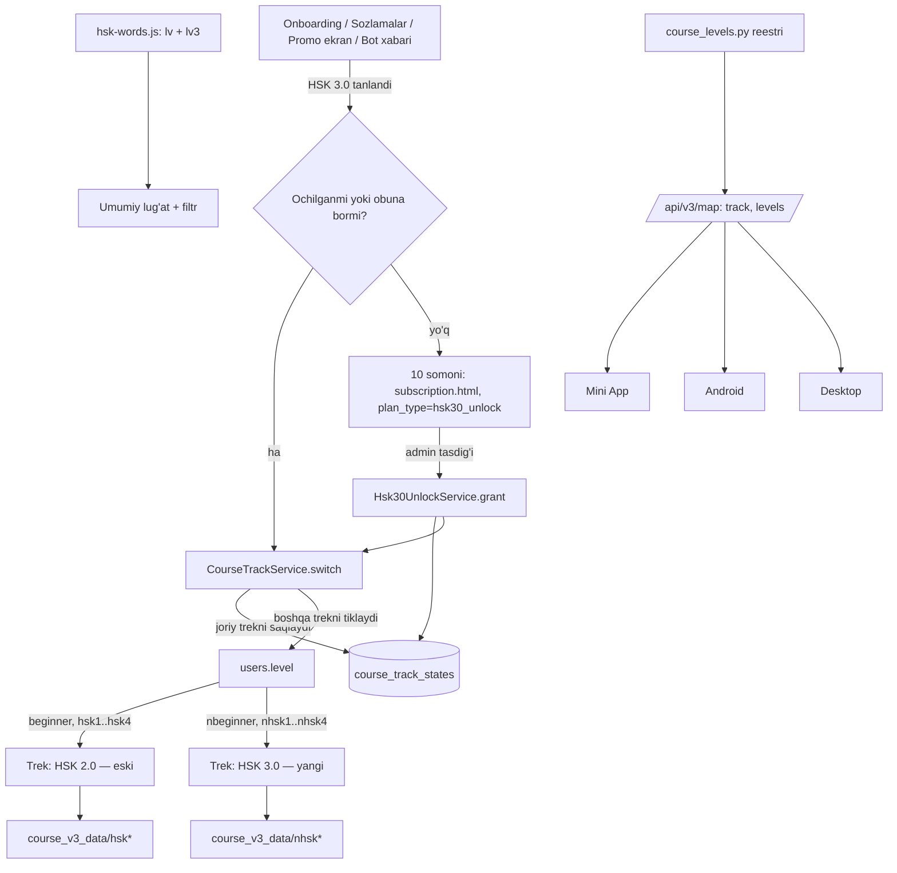

# HSK 3.0 versiyasi — alohida kurs qo'shish rejasi

Holat: 2026-09-30 — **reja to'liq tasdiqlandi, ochiq savol yo'q. Ish hali
boshlanmagan, kod o'zgartirilmagan.** HSK 3.0 uchun 1–3-daraja darslik PDF'lari
`HSK 3.0 PDF/` ichida Git LFS orqali `main` ga qo'shilgan. Ish egasi "boshla"
deganda 0-bosqichdan boshlanadi.

Research: `research/hsk-3.0/`.

## Egasining qarorlari (2026-09-29)

| # | Savol | Qaror |
|---|---|---|
| 1 | Kurs turi | HSK 3.0 — **to'liq alohida kurs**. Darslari eski HSK (2.0) bilan aralashmaydi |
| 2 | Eski kurs | Qoladi, yangisi qo'shiladi. Onboardingda va sozlamalarda almashtirgich |
| 3 | Darajalar | **HSK 3.0 · 1–4** |
| 4 | Kontent manbasi | HSK 3.0 darsliklari va rasmiy ro'yxatlar. 1–3-daraja PDF'lari repoda bor; 4-daraja manbasi alohida qo'shiladi |
| 5 | Onboarding | User o'zi tanlaydi. **Default — HSK 2.0**, HSK 3.0 yonida narx yoziladi (13-qaror sababli o'zgardi; avval default HSK 3.0 edi) |
| 6 | Obuna | Faol obuna HSK 3.0 ni ham ochadi. Obuna va to'lov logikasi o'zgarmaydi |
| 7 | XP, streak, reyting | **Ikkala kurs uchun umumiy** |
| 8 | Promo ekran | Eski userlarga ilova ichida **jami 2 marta**, orasi **kamida 3 kun** |
| 9 | Bot xabari | **Kerak** (tafsiloti pastda) |
| 10 | Test markazi (HSK 3.0 userlar) | Yangi format tayyor bo'lguncha **"Tez orada"** turadi |
| 11 | Tarjimalar (uz/ru/tj) | **Claude** tayyorlaydi va tekshiradi |
| 12 | Lug'at bo'limi | **Bitta umumiy lug'at**, faqat filtr qo'shiladi (versiya va daraja) |
| 13 | HSK 3.0 ni ochish | **Bir martalik 10 somoni.** Faol pullik obunasi yo'q user to'laydi. 10 somoni to'langach HSK 3.0 doimiy ochiladi |
| 14 | Obunachilar | **Faol pullik obuna bor paytda 10 somoni so'ralmaydi.** HSK 3.0 obuna amal qilayotgan muddat davomida ochiq turadi |
| 15 | Boshqa valyutalar | 10 somoni joriy kurs bo'yicha kerakli valyutaga o'giriladi |
| 16 | Chegirmalar | Referal 20%, admin chegirmalari va partnyor komissiyasi **qo'llanmaydi** |
| 17 | Obuna tugasa | Agar user 10 somonilik doimiy unlock'ni oldin olmagan bo'lsa, obuna tugashi bilan HSK 3.0 **yopiladi**. Userga ikki tanlov beriladi: **obunani davom ettirish** yoki **10 somoni bir marta to'lab HSK 3.0 ni doimiy ochish**. Progress saqlanadi; to'lov/yangilashgacha HSK 2.0 da bepul davom etadi |
| 18 | Trial | 7 kunlik Pro trial, referal trial va vaqtinchalik bonus (`TRIAL`, `TEMPORARY_TRIAL`) **obuna hisoblanmaydi** — HSK 3.0 uchun 10 somoni kerak |
| 19 | Alipay/WeChat | Shu summa uchun admin QR kod yuklamaguncha 10 somonilik ekranda **ko'rinmaydi** |
| 20 | Darslik dialoglari | **Aynan darslikdagi dialoglar olinadi.** Egada ulardan foydalanish uchun ruxsat bor. Hanzi/pinyin saqlanadi, UZ/RU/TJ tarjimalar tayyorlanadi |

## Hozirgi holat (kodda tekshirilgan)

- Daraja kalitlari: `beginner`, `hsk1`–`hsk4`. `{"hsk1","hsk2","hsk3","hsk4"}`
  to'plamlari 40 dan ortiq backend, 8 ta Mini App, 9 ta Android va 4 ta
  Desktop faylida qo'lda yozilgan.
- `users.level` — QA ham, kurs ham uchun yagona manba. `course_progress` —
  har userga bitta qator.
- Band almashsa progress nolga tushadi (`app/main.py`, `/api/v3/map`:
  `completed_lessons_count = 0`). Ya'ni boshqa darajaga o'tib qaytganda
  progress hozir saqlanmaydi.
- Kontent zanjiri: `scripts/seed_*` → `scripts/gen_course_v3_from_seed.py` →
  `app/static/course_v3_data/{level}/lesson_NN.json`, `{level}.json`,
  `parts_manifest.json`, `lesson_gate.js`.
- Onboarding (`CourseMiniAppOnboardingService.complete`) birinchi darsni
  legacy `course_lessons` jadvalidan qidiradi. Yangi daraja uchun qator
  bo'lmasa `course_no_lessons_available` qaytadi.
- Lug'at: `app/static/hsk-words.js` (1247 so'z, `lv:"HSK1"`…). Android'da
  offline asset sifatida ham bor. `hsk-lugat.html` `lv` bo'yicha filtrlaydi.
- Test markazi: `course_v3_data/exams/hsk1..4.json` — eski format.
- Mini App'dagi `App.levelPicker` hech qayerdan chaqirilmaydi. Daraja botdagi
  `/level` va onboarding orqali o'zgaradi.
- **To'lov:** `payments.plan_type` bor, lekin admin tasdig'i
  (`app/bot/handlers/admin_payments.py`, `admin_payment_approve_handler`)
  **har qanday** to'lovda `SubscriptionService.activate_plan` ni chaqiradi —
  `status="active"`, `payment_status="approved"`, `end_date` qo'yadi, partnyor
  komissiyasini yozadi. Tariflar: `PLAN_DURATIONS` (`10_days`, `1_month`,
  `3_months`).
- Valyuta: `SubscriptionCurrencyService.quote_card_amount(tjs_amount, country)`
  somonini joriy kurs bo'yicha UZS/RUB/USD ga o'giradi.
- "Obunachi" holati: `user_access_state_service.py` — `PAID`, `TRIAL`,
  `TEMPORARY_TRIAL` holatlari bor.

## Asosiy arxitektura qarorlari

### 1. Alohida daraja kalitlari

HSK 3.0 uchun yangi kalitlar: `nhsk1`, `nhsk2`, `nhsk3`, `nhsk4`, noldan
boshlovchi uchun `nbeginner`. Bu ichki kalit, user ko'rmaydi. Ekranda
"HSK 3.0 · 1-daraja" ko'rinadi.

**Nega yangi kalit:** daraja kaliti allaqachon hamma joyda ajratuvchi —
statik fayl yo'li, XP ref `v3-part:{level}:{n}`, `course_mistakes.level`,
eventlar, reklama, audio, challenge. Yangi kalit bo'lsa ma'lumot o'zi
ajraladi, eski userlar ma'lumotiga tegilmaydi.

**Nega `nhsk`, `hsk30_1` emas:** kodda `startswith("hsk")` va
`startswith("hsk4")` bor (`commands.py`, `course.py`, voice, drill va
challenge normalizerlari). `hsk…` bilan boshlangan kalit eski darajaga
adashib tushadi.

### 2. Yagona daraja reestri

Yangi modul `app/services/course_levels.py`: darajalar, trek, tartib,
keyingi daraja, uz/ru/tj yorliqlari, AI uchun tavsif, bepul qismlar soni.
Qo'lda yozilgan to'plamlar shu reestrga o'tkaziladi. Mini App, Android va
Desktop darajalar ro'yxatini `/api/v3/map` javobidan oladi (`track`,
`levels`), o'zida qattiq yozmaydi.

Birinchi qadam — reestrni faqat eski darajalar bilan kiritish (xulq
o'zgarmaydi, testlar bilan). Shundan keyin `nhsk*` qo'shish bitta joyda
bo'ladi.

### 3. Trek almashganda progress saqlanadi

Yangi jadval `course_track_states`:
`user_id`, `track`, `level`, `completed_lessons_count`, `unlocked_at`,
`unlock_payment_id`, `updated_at`; `unique(user_id, track)`.

Almashtirishda joriy trek holati saqlanadi, boshqa trekning saqlangan holati
qaytariladi (yo'q bo'lsa tanlangan darajadan noldan). `users.level` va
`course_progress` avvalgidek bitta faol holatni saqlaydi, shuning uchun
mavjud kod o'zgarmaydi. Trek ichidagi band almashish xulqi (nolga tushish)
o'zgartirilmaydi.

### 4. HSK 3.0 ni ochish to'lovi (10 somoni)

**Qoida:** HSK 3.0 ga kirish = bir martalik to'lov qilingan
(`course_track_states.unlocked_at`) **yoki** faol obuna bor.

- **Kim to'laydi:** faol obunasi yo'q har bir user — yangi (onboardingda
  HSK 3.0 ni tanlasa) ham, eski (promo, sozlamalar yoki bot xabaridan) ham.
- **Faol obunachi to'lamaydi.** Obunachi — `UserAccessState.PAID` (pullik obuna
  va admin bergan cheksiz ruxsat). Faol PAID holatida HSK 3.0 uchun 10 somoni
  ekrani umuman ko'rsatilmaydi. Trial va vaqtinchalik bonuslar obuna
  hisoblanmaydi (18-qaror).
- **Obuna tugaganda aniq qoida:** agar `course_track_states.unlocked_at` yo'q
  bo'lsa, HSK 3.0 darhol yopiladi. Progress o'chmaydi. Userga ikki yo'l
  ko'rsatiladi: (1) obunani yangilash — HSK 3.0 yana faqat obuna faol turgan
  muddatga ochiladi; yoki (2) 10 somoni bir marta to'lash — `unlocked_at`
  yoziladi va HSK 3.0 keyingi obuna holatidan qat'i nazar doimiy ochiq qoladi.
  Shu vaqtgacha user HSK 2.0 da bepul davom etadi.
- **10 somoni — bir marta, doimiy unlock.** 2.0 ga qaytib, yana 3.0 ga
  o'tganda qayta to'lanmaydi.
- **To'lovdan keyin hammasi odatdagidek:** bepul rejim cheklovlari, bepul
  qismlar va obuna qoidalari o'zgarmaydi.
- **Narx:** `bot_settings` da `hsk30_unlock_price_tjs`, default 10, admin
  o'zgartira oladi. Boshqa davlatlar uchun
  `SubscriptionCurrencyService.quote_card_amount` joriy kurs bo'yicha
  UZS/RUB/USD ga o'giradi.
- **Chegirma yo'q:** referal 20%, admin kampaniyalari va partnyor komissiyasi
  bu to'lovga qo'llanmaydi.
- **To'lov yo'li — mavjud:** region → to'lov turi → rekvizit → chek rasmi →
  (mavjud AI chek tekshiruvi) → admin tasdig'i. `subscription.html` qayta
  ishlatiladi, `product=hsk30_unlock` bilan tarif qadami o'tkazib
  yuboriladi. Alipay/WeChat faqat shu summa uchun admin QR kod yuklagan
  bo'lsa ko'rinadi.
- **Alohida mahsulot turi:** `payments.plan_type = "hsk30_unlock"`.
  - Admin tasdig'ida bu tur uchun **`activate_plan` chaqirilmaydi**. Faqat
    `Hsk30UnlockService.grant` HSK 3.0 ni ochadi. `status`, `payment_status`,
    `end_date`, `selected_plan_type`, partnyor komissiyasi va
    `subscription_approved` eventiga tegilmaydi.
  - Rad etishda ham obuna maydonlariga tegilmaydi.
  - User xabari (bot va Android push) alohida, 3 tilda: "HSK 3.0 ochildi" +
    "Boshlash" tugmasi.
- **Statistika:** tasdiqlangan to'lovni obuna deb hisoblaydigan joylar
  (`admin_finance_stats_service.py`, `admin_stats_service.py`,
  `partner_service.py`, `app/main.py` dagi oxirgi tasdiqlangan to'lov
  qidiruvi) `plan_type` bo'yicha filtrlanadi. Admin panelda alohida qator:
  "HSK 3.0 ochish" — soni va summasi.
- **Kutish holati:** chek yuborilgach "To'lov tekshirilmoqda". Shu vaqtda
  user HSK 2.0 da o'qiy oladi ("Keyinroq"). Tasdiqlangach xabar keladi va
  3.0 ochiladi.
- **Android:** Google Play build'da to'lov olinmaydi (Google qoidasi) —
  Telegram'ga yuboriladi, obuna bilan bir xil. Direct build mavjud direct
  checkout orqali to'laydi. Desktop ham mavjud obuna oqimi orqali.

### 5. Nima alohida, nima umumiy

| Alohida (aralashmaydi) | Umumiy (bitta profil) |
|---|---|
| Darslar, xarita, progress | Obuna (HSK 3.0 ni ham ochadi) |
| Mashq bo'limlari so'z puli (faol kurs darajasidan) | Lug'at (bitta ro'yxat + versiya/daraja filtri) |
| Xatolarim va takror (faol trek bo'yicha filtr) | XP, streak, reyting, liga |
| Test markazi imtihonlari | Til, bildirishnoma, kunlik maqsad |
| QA AI daraja chegarasi | AI Voice (daraja faol trekdan olinadi) |
| | Akkaunt va qurilmalar |

### 6. Bepul qismlar

HSK 3.0 ochilgandan keyin bepul qismlar eski qoida bo'yicha: 1-daraja —
birinchi to'liq dars (hozirgi `hsk1` kabi), 2–4-darajalar — 2 qism
(`free_course_parts_for_level`). To'lov, narx, referal va chegirma logikasi
o'zgarmaydi.

### 7. Umumiy lug'at

- Bitta fayl qoladi: `app/static/hsk-words.js` (Android asseti ham shu).
- Har so'zga ikkinchi daraja maydoni qo'shiladi: `lv3` (`"N1"`…`"N4"`).
  Eski `lv` o'zgarmaydi.
- HSK 3.0 da bor, eski ro'yxatda yo'q so'zlar ham shu faylga qo'shiladi:
  `lv` bo'sh, `lv3` to'ldirilgan.
- `hsk-lugat.html` filtri: versiya (HSK 3.0 / HSK 2.0) va daraja. Default —
  userning faol kursi. Lug'at to'lovsiz hammaga ochiq (hozirgidek).
- Mashq sahifalari (`course_v3_recognition/pronunciation/memorize.html`) so'z
  pulini faol kurs darajasi bo'yicha tanlaydi: HSK 2.0 da `lv`, HSK 3.0 da
  `lv3`. `lv` bo'sh so'z eski kurs pulida chiqmaydi.
- `scripts/split_hsk_data.py`, `memo_lv.js` va Android lug'at generatorlari
  yangi maydonni tanishi kerak.

### 8. Kontent joylashuvi

```
app/static/course_v3_data/
  nhsk1.json … nhsk4.json       # xarita
  nhsk1/lesson_NN.json …        # mini-darslar
  parts_manifest.json           # nhsk kalitlari qo'shiladi
  lesson_gate_hsk30.js          # so'z -> [daraja, qism]; eski gate raqamli darajaga bog'langan
  exams/nhsk1.json …            # yangi format imtihon (8-bosqich)
app/static/hsk-words.js         # umumiy lug'at, lv3 maydoni bilan
scripts/hsk30/
  wordlist.json                 # rasmiy ro'yxatdan: hanzi, pinyin, daraja, so'z turkumi
  grammar.json, hanzi.json
  seed_nhsk1_lesson_01.py …     # so'z + grammatika + kitob dialoglari + tarjimalar
  verify_hsk30_*.py             # tekshiruvlar
```

`gen_course_v3_from_seed.py` `--track hsk30` bilan kengaytiriladi. Qismlarga
bo'lish va checkpoint mantiqi qayta ishlatiladi.

### 9. Tarjimalar (Claude tayyorlaydi va tekshiradi)

- Eski lug'at va darslardagi tekshirilgan uz/ru/tj tarjimalar HSK 3.0 dagi
  bir xil so'zlar uchun qayta ishlatiladi.
- Yangi so'zlar va gaplar uchun Claude uch tilda tarjima yozadi.
- Avtomatik tekshiruv:
  - uchala til to'liq;
  - bir so'z hamma joyda bir xil tarjima qilingan;
  - uz — lotin, ru va tj — kirill, aralash yozuv yo'q;
  - tj matnida rus so'zi aralashmagan.
- Xato topilsa, reliz feedback orqali tuzatiladi.

## Sxema



### User oqimi

```
Yangi user:
  Onboarding → [HSK 2.0 | HSK 3.0 · 10 somoni] (default HSK 2.0)
      ├─ HSK 2.0 → daraja → maqsad → 1-dars (hozirgidek)
      └─ HSK 3.0 → daraja → maqsad → to'lov ekrani
                      ├─ to'ladi → "tekshirilmoqda" → tasdiq → HSK 3.0 · 1-dars
                      └─ Keyinroq → HSK 2.0 da boshlaydi

Eski user (HSK 2.0 da):
  Reliz kuni bot xabari (1 marta) ──┐
  Ilova ochiladi → "Yangi HSK 3.0" ekrani (jami 2 marta, orasi ≥ 3 kun)
      ├─ [HSK 3.0 ga o'tish] → obuna bor / ochilgan? → daraja tanlash → tasdiq → yangi xarita
      │                        yo'q → to'lov ekrani (10 somoni)
      └─ [Keyinroq]          → eski kurs davom etadi

Istalgan user:
  Sozlamalar → "Kurs versiyasi" → HSK 2.0 / HSK 3.0
      → HSK 3.0 tanlanganda:
          ├─ 10 somoni oldin to'langan → darhol ochiladi
          ├─ faol PAID obuna bor → pul so'ralmaydi, obuna tugaguncha ochiladi
          └─ ikkalasi ham yo'q → [Obunani davom ettirish / 10 somoni bir marta to'lash]
      → progress har ikki trek uchun saqlanadi
```

## UI (koddan oldin maket egasiga ko'rsatiladi)

1. **Onboarding:** daraja qadamining tepasida ikki segmentli almashtirgich
   `HSK 2.0 | HSK 3.0`, **default HSK 2.0**. HSK 3.0 segmentida narx
   ko'rsatiladi (obunachida ko'rsatilmaydi). Savollar soni 2 ligicha
   qoladi, faqat daraja ro'yxati trekka qarab o'zgaradi.
2. **Sozlamalar:** bitta qator "Kurs versiyasi · HSK 2.0" (til qatori
   uslubida) → ikki variantli varaq → HSK 3.0 yopiq bo'lsa to'lov ekrani,
   ochiq bo'lsa tasdiqlash oynasi: "Eski progress saqlanadi, istalgan payt
   qaytasiz".
3. **To'lov ekrani (HSK 3.0 ni ochish):** HSK 3.0 nima ekanini tushuntiruvchi
   2–3 qator, narx (userning valyutasida), "bir marta to'lanadi" izohi,
   "To'lash" va "Keyinroq" tugmalari. To'lash mavjud `subscription.html`
   to'lov qadamlariga olib boradi.
4. **Promo ekran (eski userlar):** sarlavha, nima o'zgargani haqida 2–3
   qator, ikkita tugma: "HSK 3.0 ga o'tish" va "Keyinroq". Obunasizlarga
   narx ko'rsatiladi. Qo'shimcha bezak, badge yoki animatsiya yo'q.
   - Kimga: HSK 2.0 trekidagi va reliz sanasigacha onboardingdan o'tgan
     userlar.
   - Hisobni server yuritadi (`course_miniapp_profiles.hsk30_promo_shown_count`,
     `hsk30_promo_last_shown_at`). Mini App, Android va Desktop'da **jami
     2 marta**, har qurilmada 2 martadan emas.
   - Ikkinchisi birinchisidan **kamida 3 kun** keyin. User o'tsa, boshqa
     chiqmaydi.
   - "O'tish" bosilganda tavsiya etilgan daraja: hsk1 → N1, hsk2 → N1,
     hsk3 → N2, hsk4 → N3. User o'zgartira oladi. (Eski HSK2 jami 300 so'z
     = yangi 1-daraja 300 so'z.)
5. **Bot xabari:**
   - Reliz kuni **1 marta**, faqat HSK 2.0 trekidagi userlarga (bloklangan
     va botni bloklagan userlar chiqariladi).
   - Mavjud admin broadcast moduli orqali yuboriladi. Segment filtriga trek
     qo'shiladi. **Admin tasdig'isiz yuborilmaydi** (AGENTS.md qoidasi).
   - Matnda narx va "obunachilar uchun bepul" yoziladi.
   - Tugma Mini App'ni to'g'ridan-to'g'ri promo/almashtirish varag'ida ochadi.
   - Bot xabari ilova ichidagi 2 marta hisobiga kirmaydi.
   - Matn uz/ru/tj.
6. **Test markazi (HSK 3.0 userlar):** bo'lim joyida qoladi, yangi format
   tayyor bo'lguncha "Tez orada" holatida. Eski imtihonlar HSK 3.0 userlarga
   ko'rsatilmaydi. Joy va tartib o'zgarmaydi, alohida karta qo'shilmaydi.
7. **Lug'at:** mavjud ro'yxat ustida filtr — versiya (HSK 3.0 / HSK 2.0) va
   daraja. Default — userning faol kursi.
8. **Tillar:** hamma matn uz/ru/tj. Android'da `values`, `values-ru`,
   `values-tg`; Desktop'da ham xuddi shu.

## Bosqichlar

### 0-bosqich — Kontent manbasini ajratish va normallashtirish

- 1–3-daraja HSK 3.0 darsliklari allaqachon `HSK 3.0 PDF/` ichida
  Git LFS orqali repoda turadi. 4-daraja manbasi kelganda xuddi shu oqimga
  qo'shiladi.
- Har bir darsdan tizimga kerak bo'lgan **xom manba ma'lumotlari** ajratiladi:
  - dars nomi/mavzusi va maqsadi;
  - yangi so'zlar: hanzi, pinyin, so'z turkumi;
  - grammatika: qoida va kitobdagi misollar;
  - **kitobdagi dialoglarning o'zi**: sahna, speaker A/B, hanzi, pinyin,
    dialog tartibi;
  - daraja va dars tartibi.
- UZ/RU/TJ tarjimalar alohida qatlamda tayyorlanadi. Kitobdagi dialog matni
  o'zgartirilmaydi; tarjima maydonlari qo'shiladi.
- Tayyor mashqlarni PDF'dan ko'chirish majburiy emas. Generator source
  vocabulary/grammar/dialogue asosida interaktiv mashqlarni o'zi yaratadi.
- Normallashtirilgan chiqish:
  `scripts/hsk30/wordlist.json`, `grammar.json`, `hanzi.json` va
  dars/dialog source fayllari.
- Tekshiruv: so'zlar 300/200/500/1000 (jami 2000), tanib o'qish hanzi
  246/125/284/441. Har yozuvda hanzi, pinyin va daraja bor. Takrorlar va
  ko'p o'qilishli belgilar qayd etiladi.
- Mezon: source parser/validator va `verify_hsk30_wordlist.py` toza o'tadi.

### 1-bosqich — Poydevor (userga ko'rinmaydi)

- `course_levels.py` reestri. Qo'lda yozilgan to'plamlar reestrga
  o'tkaziladi (faqat eski darajalar bilan, xulq o'zgarmaydi).
- `nhsk*` kalitlari reestrga qo'shiladi, `bot_settings` da
  `hsk30_enabled` flag o'chiq turadi.
- Migratsiya `0094_course_track_states` (+ profilga promo uchun 2 ustun).
- `CourseTrackService` (saqlash/tiklash, ochiqlik tekshiruvi) va
  endpointlar. Mini App, Android va Desktop bitta servisdan foydalanadi.
- **To'lov qismi** (4-qaror bo'yicha):
  - `plan_type = "hsk30_unlock"`, `Hsk30UnlockService.grant`;
  - admin tasdig'i va rad etishda alohida tarmoq (`activate_plan` chaqirilmaydi);
  - `hsk30_unlock_price_tjs` sozlamasi va valyuta o'girish;
  - statistika va partnyor hisobida `plan_type` filtri;
  - 3 tilda tasdiq/rad xabarlari.
- Onboarding: `nhsk*` uchun legacy `course_lessons` ga bog'liqlik olib
  tashlanadi (manifestdan olinadi). Eski darajalar xulqi o'zgarmaydi.
- AI: `app/prompts/qa_system.txt` va `course_tutor_service.py` ga
  reestrdan daraja tavsifi beriladi ("HSK 3.0, 2-daraja, jami ~500 so'z").
- Xatolarim, takror va mashq so'z puli faol trek bo'yicha filtrlanadi.
- Testlar:
  - reestr va trek almashish (saqlash, tiklash, ikki marta almashish);
  - izolyatsiya (nhsk XP ref, xatolar filtri);
  - **10 somoni tasdig'i obuna maydonlarini o'zgartirmaydi**; obuna
    tasdig'i avvalgidek ishlaydi; obunachi to'lovsiz o'tadi; to'lamagan
    obunasiz user o'ta olmaydi; chegirma va komissiya qo'llanmaydi;
  - eski xulq regressiyasi.
- Mezon: flag o'chiq holatda eski userlar uchun hech narsa o'zgarmaydi.
  `pytest` o'tadi (PROJECT_MEMORY 11-bo'limdagi 3 ta avvaldan yiqiladigan
  testdan tashqari).

### 2-bosqich — HSK 3.0 · 1-daraja kontenti

- Dars rejasi: 300 so'z, darslik/syllabus mavzulari va grammatika tartibi
  bo'yicha tuziladi.
- Har dars uchun manbadan olinadi: **dars nomi/mavzusi, yangi so'zlar
  (hanzi, pinyin, so'z turkumi), grammatika va misollar, aynan darslikdagi
  dialoglar va ularning tartibi/sahnasi**.
- Darslik dialoglari verbatim ishlatiladi (foydalanish ruxsati bor);
  UZ/RU/TJ tarjimalar alohida tayyorlanadi va tekshiriladi.
- Mashqlarni darslikdan ko'chirish shart emas: Course V3 generator
  vocabulary + grammar + dialogue ma'lumotlaridan listening, pronunciation,
  builder, gap-fill, dialog-cloze, grammar quiz, mixed review va checkpoint
  kartalarini avtomatik yasaydi.
- Tarjima: 9-qarordagi tartibda (Claude).
- Generator orqali `nhsk1/lesson_NN.json` (~100 mini-dars), xarita,
  manifest va gate yasaladi.
- Lug'at: `hsk-words.js` ga `lv3:"N1"` va yangi so'zlar; memo/strokes
  qamrovi; Android asseti qayta yasaladi.
- Tekshiruvlar:
  - har syllabus so'zi kamida bir marta o'rgatiladi;
  - misollarda shu darsgacha o'rgatilmagan so'z yo'q;
  - 3 til to'liq va 9-qarordagi tarjima tekshiruvlari o'tadi.
- Mezon: `verify_hsk30_level.py nhsk1` toza. Lokal preview'da 1-dars,
  checkpoint va paywall ishlaydi.

### 3-bosqich — Mini App UI (maket tasdiqlangach)

- Onboarding almashtirgichi (default HSK 2.0, narx), sozlamalar qatori,
  to'lov ekrani, promo ekran, xarita sarlavhasida "HSK 3.0 · 1".
- `subscription.html` da `product=hsk30_unlock` rejimi (tarif qadamisiz).
- Lug'at filtri (versiya va daraja).
- Test markazi HSK 3.0 userlarga "Tez orada".
- Mashq sahifalari (`course_v3_recognition/pronunciation/memorize/test.html`):
  `normLv` va so'z puli yangi kalitlarni taniydi.
- Mezon: flag yoqilgan test akkauntda oqim to'liq ishlaydi (to'lov → admin
  tasdig'i → 3.0 ochiladi). Flag o'chiq bo'lsa hech narsa o'zgarmaydi.

### 4-bosqich — Android va Desktop paritet

- Android: onboarding, sozlamalar, to'lov ekrani (direct — checkout, play —
  Telegram'ga), promo, xarita, lug'at filtri, Test markazi "Tez orada",
  offline lug'at asseti, to'lov push xabari. `android/tools/check_*.py`
  tekshiruvlari (`check_flavor_parity.py` ham), 3 til, `appVersionCode` +1.
- Desktop: macOS va Windows bir vaqtda (DMG/EXE parity qoidasi).
- Mezon: bitta akkaunt uchta klientda bir xil trek, daraja va ochiqlik
  holatini ko'rsatadi. Promo jami 2 marta chiqadi.

### 5-bosqich — Bot va admin

- `/level` va bot daraja klaviaturasi faol trek darajalarini ko'rsatadi.
  `_course_level_label` yorliqlari reestrdan olinadi.
- Legacy bot kursi (`app/bot/handlers/course.py`) nhsk userlarni Mini App'ga
  yo'naltiradi, ularni legacy oqimga kiritmaydi.
- Admin: to'lov kartasida mahsulot nomi ("HSK 3.0 ochish · 10 TJS"),
  narx sozlamasi, statistikada alohida qator.
- Admin broadcast: segment filtriga trek va HSK 3.0 darajalari; bot xabari
  shabloni (uz/ru/tj) va Mini App'ga olib boradigan tugma.
- Reklama darajalariga HSK 3.0 qo'shiladi.

### 6-bosqich — Ishga tushirish (HSK 3.0 · 1)

- Atomik deploy: data, backend, frontend va migratsiya bitta relizda.
  Flag faqat 1-daraja uchun yoqiladi (`hsk30_live_levels = nhsk1`).
- 1-darajani tugatgan user uchun keyingi daraja tayyor bo'lguncha oddiy
  "tez orada" holati (3 tilda, qo'shimcha bezaksiz).
- Bot xabari admin tasdig'idan keyin yuboriladi.
- `PROJECT_MEMORY.md` yozuvi. Release feedback qoralamasi (AGENTS.md
  qoidasi) — admin tasdig'isiz yuborilmaydi.
- Kuzatiladi: onboardingda trek tanlovi ulushi, to'lov ekrani → to'lov →
  tasdiq konversiyasi, promo va bot xabari → o'tish konversiyasi, eski
  kursga qaytishlar soni, 1-dars yakuni.

### 7-bosqich — 2, 3, 4-darajalar

Har daraja 2-bosqich tartibida, alohida reliz sifatida, flag orqali ochiladi.
10 somoni butun HSK 3.0 ni ochadi — keyingi darajalar uchun qayta to'lov yo'q.

| Daraja | Yangi so'z | Taxminiy mini-dars |
|---|---:|---:|
| 2 | 200 | ~70 |
| 3 | 500 | ~160 |
| 4 | 1000 | ~300 |

### 8-bosqich — Test markazi (yangi format)

Rasmiy namuna tuzilishi:

| Daraja | Listening | Reading | Writing |
|---|---:|---:|---:|
| 1 | 20 | 20 | — |
| 2 | 25 | 25 | 10 |
| 3 | 30 | 30 | 10 |
| 4 | 32 | 32 | 6 |

- Tayyor bo'lgan daraja uchun "Tez orada" o'rniga shu joyning o'zida haqiqiy
  test ochiladi (alohida tugma yoki karta qo'shilmaydi).
- 3–4-darajalarning og'zaki qismi keyinroq AI Voice bilan qo'shiladi.
- Final ball shkalasi hali rasmiy tasdiqlanmagan, shuning uchun test
  "tayyorgarlik testi" deb ataladi, "rasmiy natija" deb emas.

## Xavflar

| Xavf | Himoya |
|---|---|
| 10 somonilik to'lov tasdiqlanganda obuna yoqilib ketadi | `plan_type` bo'yicha alohida tarmoq, `activate_plan` chaqirilmaydi, test bilan mixlanadi |
| Obuna daromadi va konversiya statistikasi buziladi | Tasdiqlangan to'lovni o'qiydigan joylar `plan_type` bo'yicha filtrlanadi, alohida qator |
| Yangi user admin tasdig'ini kutib qoladi | Kutish paytida HSK 2.0 da o'qiy oladi; tasdiqda xabar keladi |
| Qo'lda yozilgan daraja to'plami qolib ketadi va nhsk user `hsk1` ga tushadi | Reestr + test: `app/` da yangi `{"hsk1","hsk2",…}` literali taqiqlanadi |
| Trek almashganda progress yo'qoladi | `course_track_states` + testlar, almashtirishdan oldin tasdiq oynasi |
| Kontent hajmi katta (2000 so'z, 3 til) | Darajama-daraja reliz, eski tarjimalarni qayta ishlatish |
| Tarjimalarni odam tekshirmaydi | Eski tekshirilgan tarjimalar qayta ishlatiladi, avtomatik tekshiruvlar, reliz feedback orqali tuzatish |
| Umumiy lug'atga yangi so'z qo'shilsa eski mashqlarga tushib qoladi | Mashq puli `lv` / `lv3` bo'yicha filtrlanadi, test bilan mixlanadi |
| Darslik kontentidan foydalanish huquqi | Egada dialoglardan foydalanish ruxsati bor; source provenance saqlanadi. Mashqlar generator tomonidan yaratiladi |
| Imtihon formati o'zgarishi (hali pilot) | Test markazi eng oxirida, "tayyorgarlik" deb nomlanadi |
| Android offline hajmi oshadi | Lug'at asseti o'lchami reliz oldidan o'lchanadi |

## Keyingi qadam

Ochiq savol qolmadi. Ish egasi "boshla" deganda boshlanadi:

1. 0-bosqich: repodagi HSK 3.0 1–3 darsliklardan source ma'lumotlar
   (so'z, grammatika, misol, **dialog**) ajratiladi va validator bilan tekshiriladi.
2. 4-daraja manbasi kelganda shu pipeline orqali qo'shiladi.
3. 1-bosqich: poydevor (flag o'chiq, userlar hech narsa sezmaydi).
